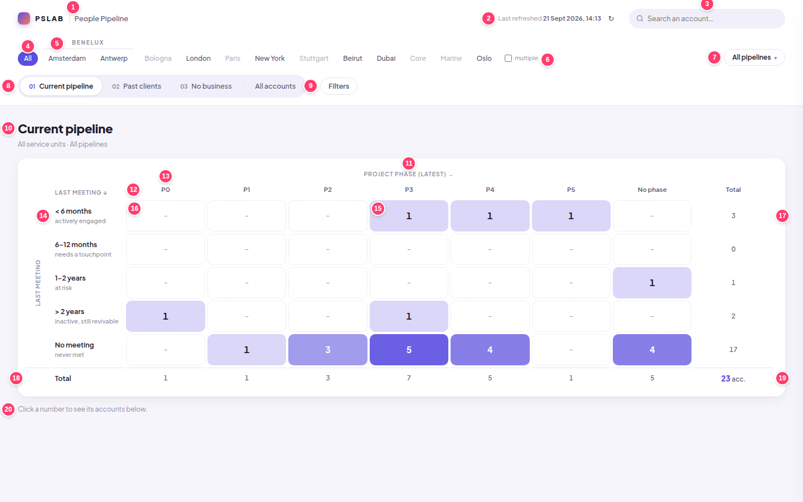

# People Pipeline

A Google Apps Script web app for PSLAB. It reads the **"people pipeline.xlsx"** export from Google Drive and shows every account on four "maps" (matrices), with filters, search, account details and Excel / PDF export. It is **read only**: it never changes the Drive file.



## Folders

Every part of the screen has its own folder in `app/`, containing its `.html` (if any), `.css` and `.js`:

```
app/
  index.html        page skeleton: lists every file below, in order
  core/             base.css (colours, fonts, buttons) · config.js (settings) · helpers.js · data.js · main.js (start + refresh)
  header/           header.html · header.css · header.js (logo, service units, pipelines, tabs)
  search/           search.css · search.js (search box + results)
  filters/          filters.css · filters.js (filter rules) · filter-panel.js (the Filters panel)
  matrix/           matrix.css · maps.js (the 4 maps: rows, columns) · matrix.js (draws the grid)
  table/            table.css · table.js (account table under the matrix)
  details/          details.html · details.css · details.js (account side panel)
  export/           export.js (Excel / PDF)
server/             Code.js (reads Drive, links the sheets) · XlsxReader.js (reads the .xlsx)
appsscript.json     Apps Script settings (time zone, web app access)
build.js            puts app/ together into dist/Index.html for Apps Script
docs/               guides (below)
```

**[docs/SCREEN-GUIDE.md](docs/SCREEN-GUIDE.md) shows every item on the screen and exactly which file and CSS class controls it.**

## Working on it

```bash
git pull          # get the latest version
npm run push      # build + send to Apps Script   (PowerShell blocked? use: npm.cmd run push)
```

Then check it in Apps Script with **Deploy → Test deployments**, and publish with **Deploy → Manage deployments → ✏️ → New version**.
More in [docs/SETUP.md](docs/SETUP.md).

## Quick "where do I change…"

| Change | File |
|---|---|
| Colours, font, rounding | `app/core/base.css` (top) |
| Service units, groups, pipelines, value buckets | `app/core/config.js` |
| Rows / columns of a map | `MAPS` in `app/matrix/maps.js` |
| Matrix look (cells, spacing, titles) | `app/matrix/matrix.css` |
| Columns of the account table | `TCOLS` in `app/table/table.js` |
| Lines in the account details overview | `openDetail()` in `app/details/details.js` |
| Filters in the panel | `FDEF` in `app/filters/filters.js` |
| Excel / PDF columns | `expRecord()` / `PDF_COLS` in `app/export/export.js` |
| Which Drive file is read | `SOURCE_FILE_NAME` / `SOURCE_FILE_ID` in `server/Code.js` |

## Docs

- [docs/SCREEN-GUIDE.md](docs/SCREEN-GUIDE.md): every item on the screen and where to change it
- [docs/SETUP.md](docs/SETUP.md): VS Code, GitHub and Apps Script, step by step
- [docs/HOW-IT-WORKS.md](docs/HOW-IT-WORKS.md): how the code works
