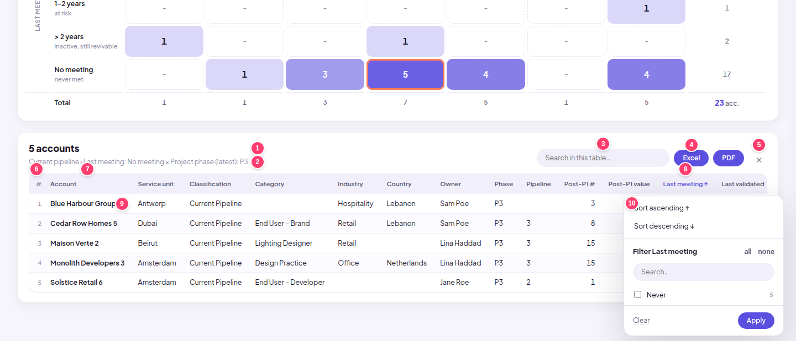
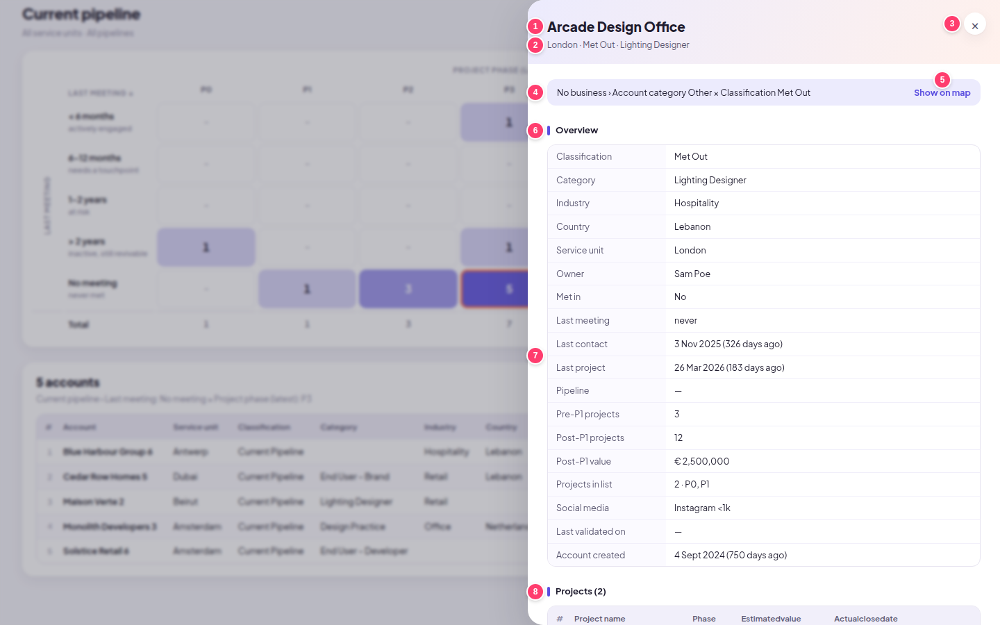
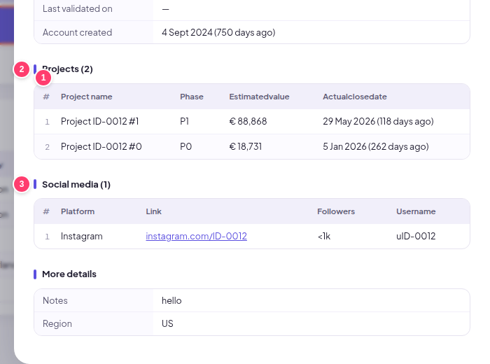
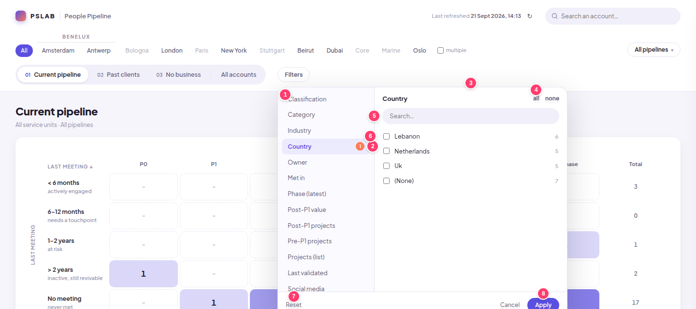
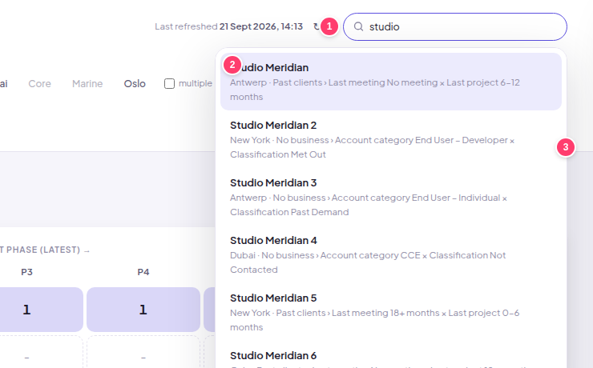
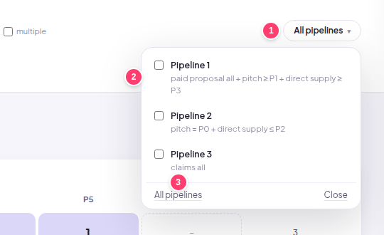

# Screen guide: what is where

Every numbered item on the screenshots, and the files that control it:

- **HTML**: where it sits on the page (the fixed markup)
- **JS**: the code that fills it in or reacts to clicks (`file` → `function`)
- **CSS**: how it looks (`file` → `.class`)

All paths are inside [`app/`](../app). The screenshots use made-up data.

> **Colours, fonts, corner rounding and shadows** are set once in `core/base.css` (`:root`). Change them there and they change everywhere.
> After any change: `npm run push` (builds and sends to Apps Script), then check it in *Deploy → Test deployments*.

---

## 1. Top of the page and the matrix

| # | What you see | HTML | JS | CSS |
|---|---|---|---|---|
| 1 | Logo "PSLAB · People Pipeline" | `header/header.html` (`.logo`) | none | `header/header.css` → `.logo`, `.logo-mark` (the coloured square), `.logo-name`, `.logo-app` |
| 2 | "Last refreshed …" + ↻ refresh button | `header/header.html` (`#rf`) | `header/header.js` → `renderRefresh()`; the button calls `refresh()` in `core/main.js` | `header/header.css` → `.rf` |
| 3 | Search box | `header/header.html` (`.gs`) | `search/search.js` → `gSearch()`, `gKey()` | `search/search.css` → `.gs`, `.gs-icon` |
| 4 | Service unit buttons (All, London, Beirut …) | `header/header.html` (`#units`) | `header/header.js` → `renderUnits()`, `setUnit()`. The order is `UNIT_ORDER` in `core/config.js` | `header/header.css` → `.units button`, `.on` (selected), `.nodata` (faded: no accounts) |
| 5 | Unit group "BENELUX" | `#units` | `header/header.js` → `setGroup()`. Groups are `GROUPS` in `core/config.js` | `header/header.css` → `.ugrp`, `.grp`, `.row` |
| 6 | "multiple" tick box | `#units` | `header/header.js` → `toggleMulti()` | `header/header.css` → `.multi` |
| 7 | Pipeline menu button | `header/header.html` (`#pipes`) | `header/header.js` → `renderUnits()`, `setPipe()`. Names and descriptions are `PIPES` in `core/config.js` | `header/header.css` → `.pbtn` |
| 8 | Map tabs (01 Current pipeline … All accounts) | `header/header.html` (`#tabs`) | `header/header.js` → `renderUnits()` (bottom part), `setView()` | `header/header.css` → `.tabs`, `.tabs button.on`, `.far` ("All accounts") |
| 9 | "Filters" button + "clear" | `header/header.html` (`#fbtn`) | `filters/filter-panel.js` → `renderFilters()`, `togglePanel()`, `clearFilters()` | `filters/filters.css` → `.fb`, `.fb span` (count), `.fclear` |
| 10 | Map title + the selection under it | drawn in `<main>` | `matrix/matrix.js` → `render()`, `scopeText()`, `filterText()`. Titles are `MAPS[…].title` in `matrix/maps.js` | `matrix/matrix.css` → `.head`, `h1`; `core/base.css` → `.meta` |
| 11 | Axis name on top ("PROJECT PHASE (LATEST) →") | `<main>` | `matrix/matrix.js` → `render()`; text is `MAPS[…].x` in `matrix/maps.js` | `matrix/matrix.css` → `.grid th.xl` |
| 12 | Axis name on the side ("LAST MEETING ↓", also the vertical one) | `<main>` | `render()`; text is `MAPS[…].y` | `matrix/matrix.css` → `.grid th.xl`, `.grid th.yl` |
| 13 | Column titles (P0 … / 0–6 months …) | `<main>` | `render()`; the list is `MAPS[…].cols` in `matrix/maps.js` | `matrix/matrix.css` → `.grid th.col` |
| 14 | Row titles + small text under them | `<main>` | `render()`; the list is `MAPS[…].rows` (`t` = title, `s` = small text) | `matrix/matrix.css` → `.grid th.row` (its `padding` = the space to the cells), `.grid th.row small` |
| 15 | A cell with a number (click it to see its accounts) | `<main>` | `render()` (colour strength = number ÷ biggest number); a click calls `openCell()` in `table/table.js`. Which cell an account goes in: `MAPS[…].place()` | `matrix/matrix.css` → `.grid td.c`, `.sel` (selected, coral border), `.hl` (yellow glow after search). Colour: `--heat-rgb` in `core/base.css` |
| 16 | An empty cell (–) | `<main>` | `render()` | `matrix/matrix.css` → `.grid td.zero` |
| 17 | Row totals (right) | `<main>` | `render()` | `matrix/matrix.css` → `.grid td.tot`, `.grid th.tot` |
| 18 | Column totals row | `<main>` | `render()` | `matrix/matrix.css` → `.grid tr.sum` |
| 19 | Total accounts on this map | `<main>` | `render()` | `matrix/matrix.css` → `.grid td.grand` |
| 20 | "Click a number…" hint | `<main>` | `render()` | `core/base.css` → `.hint` |

Also in `<main>`:
- **"Reading the source file…" while loading:** `app/index.html` (`.loading`, `.spinner`). Styled in `core/base.css`.
- **"No accounts for this selection":** `render()` in `matrix/matrix.js`. Styled by `.empty` in `core/base.css`.

---

## 2. Account table (under the matrix)

| # | What you see | JS | CSS |
|---|---|---|---|
| 1 | "5 accounts" | `table/table.js` → `renderList()` | `table/table.css` → `.inh h2` |
| 2 | Which cell this is ("Current pipeline › …") | `table/table.js` → `listBlock()` (text made in `render()`) | `core/base.css` → `.meta` |
| 3 | Search in this table | `listBlock()`, `gridRows()` (searches name, owner, country) | `table/table.css` → `.dtools input` |
| 4 | Excel / PDF buttons | `export/export.js` → `exportList()`, `doExport()`; Excel columns are `expRecord()`, PDF columns are `PDF_COLS` | `core/base.css` → `.btn` |
| 5 | × close the table | `table/table.js` → `closeCell()` | `table/table.css` → `.x2` |
| 6 | **#** counter column | `table/table.js` → `renderList()` (`<td class="cnt">`) | `table/table.css` → `.tb .cnt` |
| 7 | Column titles (click to sort / filter) | `renderList()`; the columns are `TCOLS` at the top of `table/table.js` (`t` = title, `g` = value shown, `s` = sort value) | `table/table.css` → `.tb th` |
| 8 | Sorted / filtered column (coloured, ↑ ↓, ●) | `renderList()` | `table/table.css` → `.tb th.s`, `.fdot` |
| 9 | A row (click it to open the details panel) | `renderList()` → `openDetail()` | `table/table.css` → `.tb td`, row stripes `.tb tbody tr:nth-child(even)`, hover `.tb tbody tr:hover` |
| 10 | Column menu: sort + filter by value | `table/table.js` → `openHead()`, `renderHeadList()`, `headSort()`, `headApply()` | `table/table.css` → `.hpop`, `.hp-s`; the list inside uses `.fp-list` from `filters/filters.css` |

Also:
- **"Show more (… left)"** button: `renderList()`, styled by `.more`.
- **Dates such as "19 Dec 2025 (279 days ago)":** made by `dateAgo()` in `core/helpers.js`, used in `TCOLS` (Last meeting, Last validated).

---

## 3. Account details panel

| # | What you see | HTML | JS | CSS |
|---|---|---|---|---|
| 1 | Account name | `details/details.html` (`#aTitle`) | `details/details.js` → `openDetail()` | `details/details.css` → `.dh h2` |
| 2 | Unit · classification · category | `#aMeta` | `openDetail()` | `details/details.css` → `.dh .meta` |
| 3 | × close | `details/details.html` (`.x`) | `details/details.js` → `closeDrawer()` | `details/details.css` → `.x` |
| 4 | Where the account sits on the maps | `#aBody` | `details/details.js` → `locate()` | `details/details.css` → `.loc` |
| 5 | "Show on map" | `#aBody` | `search/search.js` → `goTo()` | `details/details.css` → `.loc button` |
| 6 | Section titles (Overview, Projects, Social media …) | `#aBody` | `openDetail()` | `details/details.css` → `.det h3` (the small bar is `.det h3::before`) |
| 7 | Overview list (label / value) | `#aBody` | `openDetail()`: the `kv` list (add or remove a line there). Dates use `dateAgo()` | `details/details.css` → `.kv` |
| 8 | Projects / Social media / Other linked rows | `#aBody` | `details/details.js` → `groupTables()`, `rowsTable()` | `table/table.css` (`.tb`) + `details/details.css` (`.det table.tb`) |

| # | What you see | JS | CSS |
|---|---|---|---|
| 1 | **#** counter column in the panel's tables | `details/details.js` → `rowsTable()` | `table/table.css` → `.tb .cnt` |
| 2, 3 | Projects / Social media tables. Dates get "(N days ago)" | `rowsTable()`, `fmtVal()`, `cellHtml()` (links, service units) | `table/table.css` → `.tb` |

- **"More details" (bottom of the panel):** every other column in the Excel file, shown automatically. Columns that shouldn't appear there are listed in `DET_HIDE` in `details/details.js`. Nicer column names are set in `pretty()` in `core/helpers.js`.
- **The grey layer behind the panel:** `details/details.html` (`#dim`), styled by `.dim`.

---

## 4. Filter panel

| # | What you see | JS | CSS |
|---|---|---|---|
| 1 | List of filters | `filters/filter-panel.js` → `renderPanel()`, `panelKeys()`. The filters themselves are `FDEF` in `filters/filters.js` | `filters/filters.css` → `.fp-l button`, `.on` |
| 2 | Number of values ticked | `renderPanel()`, `draftCount()` | `filters/filters.css` → `.fp-l button span` |
| 3 | Name of the chosen filter | `renderPanelOpts()` | `filters/filters.css` → `.fp-t` |
| 4 | all / none | `panelAll()` | `core/base.css` → `.lnk` |
| 5 | Search the values | `renderPanelList()` | `filters/filters.css` → `.fp-q` |
| 6 | Values with their number of accounts | `renderPanelList()`, `popOptions()` | `filters/filters.css` → `.fp-list label`, `small` |
| 7 | Reset / Cancel | `panelReset()`, `closePanel()` | `core/base.css` → `.lnk` |
| 8 | Apply | `panelApply()` | `core/base.css` → `.btn` |

**Social media filters** (platform, followers…) are made automatically from the social media sheet by `buildSocialFilters()` in `filters/filters.js`. **Whether an account passes all filters** is decided by `pass()` in `filters/filters.js`.

---

## 5. Search results and 6. pipeline menu

| # | What you see | JS | CSS |
|---|---|---|---|
| 1 | Search box (type 2+ letters, ↑ ↓ Enter work) | `search/search.js` → `gSearch()`, `gKey()` | `search/search.css` → `.gs input` |
| 2 | A result (click → jumps to the map, cell glows yellow) | `gSearch()`, `goTo()` | `search/search.css` → `.gres button`, `.act` (keyboard-selected) |
| 3 | Where it is (unit · map › row × column) | `gSearch()` + `locate()` in `details/details.js` | `search/search.css` → `.gres small` |

| # | What you see | JS | CSS |
|---|---|---|---|
| 1 | Pipeline button (shows what's selected) | `header/header.js` → `renderUnits()` | `header/header.css` → `.pbtn` |
| 2 | Pipelines with their description (tick several) | `renderUnits()`, `setPipe()`; texts are `PIPES` in `core/config.js` | `header/header.css` → `.pmenu label` |
| 3 | All pipelines / Close | `setPipe(null)` | `header/header.css` → `.pm-f` |

---

## Other things you may want to change

| I want to… | Go to |
|---|---|
| Change the matrix colour | `--heat-rgb` in `core/base.css` (write it as `r, g, b`) |
| Change the accent colour (buttons, active tab) | `--accent` and `--accent-soft` in `core/base.css` |
| Change the font | the Google Fonts `<link>` in `app/index.html` + `--font` in `core/base.css` |
| Make the matrix cells taller or shorter | `.grid td.c` and `.grid td.c button` (`height`, `min-height`) in `matrix/matrix.css` |
| Change the space between cells | `border-spacing` on `table.grid` in `matrix/matrix.css` |
| Change the text of a toast message | search for `toast(` in the `.js` files |
| Change the "(N days ago)" wording | `agoText()` in `core/helpers.js` |
| Change how dates look | `fmtXl()` in `core/helpers.js` |
| Change the loading text | `app/index.html` (`.loading`) |
| Make the details panel wider | `.drawer` → `width` in `details/details.css` |
